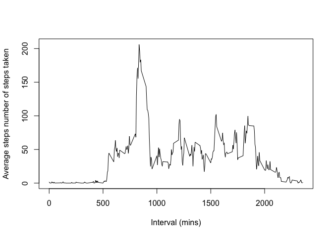
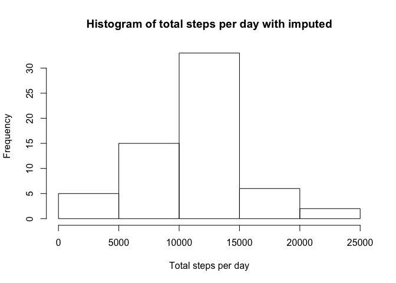
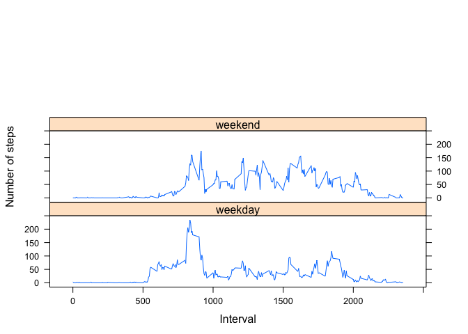

# Reproducible Research: Peer Assessment 1


```r
library(knitr)
opts_chunk$set(echo = TRUE)
```

## Loading and preprocessing the data


### 1. Load the data

```r
# Read in the data for the assignment.
# Headings are "steps", "date" and "interval"
# ("steps" column includes rows with NAs -
# the other columns do not.)
data = read.csv("activity.csv")

# Keep original data
origData = data
```

### 2. Preprocess the data

```r
# It appears that the only preprocessing required is to
# remove missing values (and that only for particular
# steps in the assignment).  Also, only the "steps"
# column has missing values.
#
# After examination in R and in Unix it appears that days
# either just  have NA's for steps for every measurement
# or they have proper  numerical values for steps for
# every measurement.  So simply removing all of the records
# with NA's should be safe.
#
# But this will cause problems later when we want to
# impute values (because we will need to know which
# measurements are missing and need to be filled in).
dataNoNA = data[!(is.na(data$steps)),]
```

## What is mean total number of steps taken per day?

### 1. Calculate the total number of steps taken per day

```r
totStepsPerDay = aggregate(dataNoNA$steps, list(dataNoNA$date), sum)
```
### 2. Make a histogram of the total number of steps taken each day

```r
hist(totStepsPerDay$x, main = "Histogram of total steps per day", xlab = "Total steps per day")
```

 

### 3. Calculate and report the mean and median total number of steps taken per day

```r
meanTotSteps = mean(totStepsPerDay$x, na.rm = TRUE)
```
The mean number of steps is given by:

```r
meanTotSteps
```

```
## [1] 10766.19
```

```r
medTotSteps = median(totStepsPerDay$x, na.rm = TRUE)
```
The median number of steps is given by:

```r
medTotSteps
```

```
## [1] 10765
```


## What is the average daily activity pattern?
### 1. Make a time series plot (i.e. type="l") of the 5-minute interval (x-axis) and the average number of steps taken, averaged across all days (y-axis)

```r
avgSteps = tapply(dataNoNA$steps, dataNoNA$interval, mean)
intervalList = sort(unique(dataNoNA$interval))

plot(avgSteps ~ intervalList, type = "l", xlab = "Interval (mins)", ylab = "Average steps number of steps taken")
```

 

### 2. Which 5-minute interval, on average across all days in the dataset, contains the maximum number of steps?

```r
# avgSteps vs interval
maxAvgSteps = max(avgSteps)
```
The interval which on average across all days in the dataset contains the maximum number of steps is:

```r
intervalList[avgSteps == maxAvgSteps]
```

```
## [1] 835
```

## Imputing missing values

### 1. Calculate and report the total number of missing values in the dataset
The total number of missing values in the dataset is given by:

```r
sum(is.na(data$steps) | is.na(data$date) | is.na(data$interval))
```

```
## [1] 2304
```

### 2. Devise a strategy for filling in all of the missing values in the dataset.
Firstly, a time in minutes is computed, using the date and five-minute interval in the day, for each row of the dataset.  A simple linear regression model is fit (to steps as a function of the time) in order to model the trend in the data.  Then the trend modelled in this way is subtracted and the periodic component of the data is modelled.
The periodic component of the data is modelled.  Firstly a time in the week is computed for each row of the dataset. Then the average value of the de-trended steps for each time in the week is computed.
The steps can now be predicted by computing a trend term and periodic term and summing them.  The trend for the given time (itself computed from the date and interval as before) is computed using the linear regression model and the periodic component by looking up the value from the previous computation for the time in the week.  The missing values are imputed by using this method of computing predicted values.


```r
# Get first day and subtract it; so the times start from zero
firstDay = sort(as.Date(data$date))[1]
data$time = as.numeric(as.Date(data$date)-firstDay, units="mins") + data$interval
trendMod = lm(data$steps ~ data$time)
# Treat the original data as new, in order to get predictions for the rows
# with missing values
stepsLinTrendPred = predict.lm(trendMod, newdata = data)
data$trend = stepsLinTrendPred
data$stepsDetrend = data$steps - stepsLinTrendPred

# Model periodic component of the data
weekInMins = 7*24*60
data$timeInWeek = data$time %% weekInMins
dtAvgStepsAtTimeInWeek = tapply(data$stepsDetrend, data$timeInWeek, function(x){mean(x, na.rm=TRUE)})

nrows = dim(data)[1]
data$seasonal = rep(0, nrows)
for(i in 1:nrows){
  # This is looks up dtAvgStepsAtTimeInWeek like a hash/ dictionary
	data$seasonal[i] = dtAvgStepsAtTimeInWeek[as.character(data$timeInWeek[i])]
}
stepsFullPred = data$trend + data$seasonal
```
### 3. Create a new dataset that is equal to the original dataset but with the missing data filled in.

```r
# First just get a copy of the original dataset
dataWithImputed = origData
# Look up predicted values where we want to impute missing
# values - otherwise use the original values.
dataWithImputed$steps = ifelse(is.na(origData$steps), stepsFullPred, origData$steps)
```
### 4. Make a histogram of the total number of steps taken each day and calculate

```r
# the mean and median total number of steps taken per day.
totStepsPerDayWithImputed = tapply(dataWithImputed$steps, dataWithImputed$date, sum)
hist(totStepsPerDayWithImputed, main = "Histogram of total steps per day with imputed", xlab = "Total steps per day")
```

 

```r
meanTotStepsWithImputed = mean(totStepsPerDayWithImputed, na.rm = TRUE)
```
The mean number of total steps for the data set with imputed missing values is:

```r
meanTotStepsWithImputed
```

```
## [1] 10816.54
```


```r
medTotStepsWithImputed = median(totStepsPerDayWithImputed, na.rm = TRUE)
```
The median number of total steps for the data set with imputed missing values is:

```r
medTotStepsWithImputed
```

```
## [1] 11015
```

The missing data is not equally represented among different days of the week; so given that the number of steps at various times is not the same on average on different days of the week, it would be expected that the mean and median total steps would change on filling in the data for the missing days.


## Are there differences in activity patterns between weekdays and weekends?

### 1. Create a new factor variable in the dataset with two levels - "weekday" and "weekend"

```r
data$daytype = ifelse(format(as.Date(data$date), "%a") %in% c("Sat", "Sun"), "weekend", "weekday")
data$daytype = as.factor(data$daytype)
```
### 2. Make a panel plot containing a time series plot of the 5-minute interval and average number of steps taken, averaged across all weekday or weekend days.


```r
dataWeekend = data[data$daytype == "weekend", ]
weekendAvgStepsAtInterval = aggregate(dataWeekend$steps, list(dataWeekend$interval), function(x){mean(x, na.rm=TRUE)})
dataWeekday = data[data$daytype == "weekday", ]
weekdayAvgStepsAtInterval = aggregate(dataWeekday$steps, list(dataWeekday$interval), function(x){mean(x, na.rm=TRUE)})
weekendAvgStepsAtInterval$daytype = "weekend"
weekdayAvgStepsAtInterval$daytype = "weekday"
avgStepsAtInterval = rbind(weekendAvgStepsAtInterval, weekdayAvgStepsAtInterval)

# Changed my chosen method of plotting in order to match the example plot in this case
library(lattice)
xyplot(avgStepsAtInterval$x ~ avgStepsAtInterval$Group.1 | avgStepsAtInterval$daytype, type = "l", ylab = "Number of steps", xlab = "Interval", layout = c(1,3))
```

 
